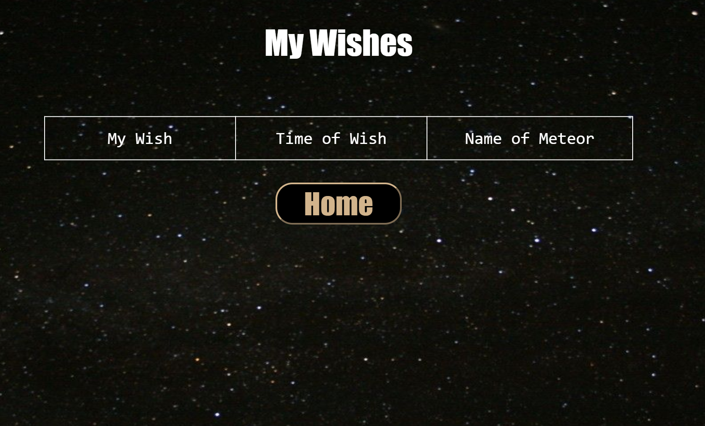

# CatchAShootingStar

Note: Still adjusting UI, work still in progress...

## Description
A Chrome Extension that allows users to see when and where a shooting star has occurred and make a wish if shooting star has been "caught". <br>
This extension is intended to raise awareness for light pollution. <br>
If a new shooting star has been "caught", yellow sparkles would appear within the bottle and the user can choose to open it.

Then the user is able to see the information of the shooting star.

The user can choose to make a wish and name the shooting star.

If no shooting star is caught, there will be no yellow sparkles inside the bottle and the user cannot open it.

By clicking on "Go to my wishes", we can see a list of the wishes user has made. The image below currently has none.


<br>

## Usage
```git clone``` this repo and start ```http-server```. <br>
Go to browser and enter url: ```localhost:8080/home.html``` (you can choose any port you like) <br> <br>

UI: Three.js for 3d effects and animations <br>
Storage: local web storage for wishes and meteor events <br>
WebScraper: scrapes information off of American Meteor Society's site every hour using crontab, cheerio, node/expressJS <br>
